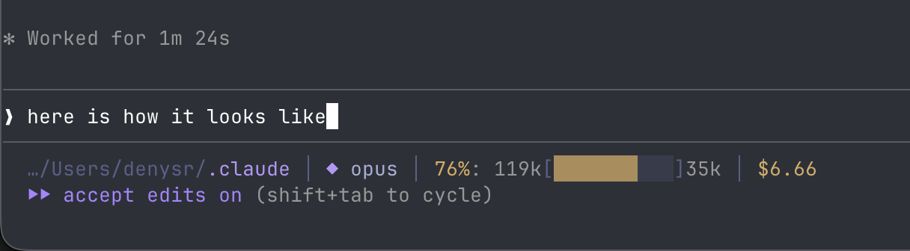

# statusline

A rich status line for Claude Code with Tokyo Night Storm colors.



## What It Shows

```
…/Projects/my-app │  main ✓ │ ◆ opus │ 42%: 52k[▓▓▓▓░░░░░░]72k │ ⏳1/3 │ ⚡2 │ ⏱12m │ $0.45
```

| Section | Description |
|---------|-------------|
| `…/Projects/my-app` | Shortened directory path (last 3 segments) |
| ` main ✓` | Git branch + clean/dirty status (✓/✗) + unpushed count (↑N) |
| `⎔` | Worktree indicator (shown when in a git worktree) |
| `◆ opus` | Active model (◆ opus, ◇ sonnet, ○ haiku) |
| `42%: 52k[▓▓▓░░░░]72k` | Context window usage with progress bar and remaining tokens |
| `⏳1/3` | Active tasks (in-progress/pending) |
| `⚡2` | Connected MCP servers |
| `⏱12m` | Session duration |
| `$0.45` | Session cost |

## Colors

Uses the [Tokyo Night Storm](https://github.com/enkia/tokyo-night-vscode-theme) palette with true color (24-bit) ANSI escapes. Context bar changes color dynamically: green → yellow (>60%) → red (>80%).

## Install

```bash
cd claude-toolkit
chmod +x statusline/install.sh
./statusline/install.sh
```

## Requirements

- `jq` — `brew install jq`
- `gdate` (optional, for session duration) — `brew install coreutils`
- Falls back to `python3` for date parsing if `gdate` is unavailable
- Terminal with true color support (iTerm2, Ghostty, Alacritty, Kitty, etc.)

## Manual Setup

Add to `~/.claude/settings.json`:

```json
{
  "statusLine": {
    "type": "command",
    "command": "/Users/you/.claude/statusline.sh"
  }
}
```
